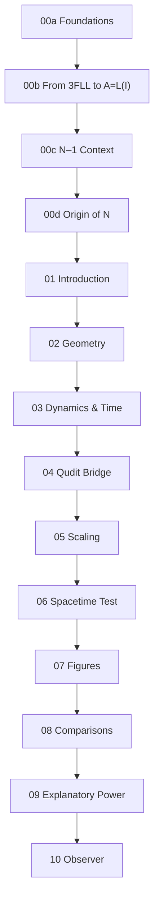

# Logic Field Theory (LFT) Repository

## Purpose
This repository develops **Logic Field Theory (LFT)** — a framework proposing that physical reality emerges from the logical filtering of an infinite information space:

**A = L(I)**

- **I** = infinite information space  
- **L** = logical operator (Identity, Non-Contradiction, Excluded Middle)  
- **A** = actuality (what exists)

The project builds a formal and computational chain from first logical principles to spacetime, quantum structure, and observational constraints.

---

## Core Results
- **Dimensionality Rule:** N distinguishable objects → (N–1) spatial dimensions  
- **Time:** Emerges as monotonic logical descent (Lyapunov functional)  
- **Geometry:** Symmetric group S_N ≅ Weyl group of A_{N–1}, producing permutohedra  
- **Quantum Bridge:** Probability simplex ↔ permutohedron (qudit structure)  
- **Spacetime:** For N=4, yields robust 3+1 structure with aligned logical time  
- **Observer:** Measurement = constraint injection, reproducing collapse/quantum Zeno

Validated computationally up to N=6.

---

## Repository Structure
- `notebooks/` — main derivations (00a Foundations → 10 Observer)  
- `outputs/` — figures, CSVs, JSON summaries  
- `manuscript/` — LaTeX source & PDFs

---

## Roadmap (Notebook Sequence)

### Pre-Theory (Philosophical & Logical Foundations)
- **00a Foundations** — Why logic is fundamental, physics must derive stage (dimension, time).  
- **00b From 3FLL to A=L(I)** — Makes 3FLL algorithmic; defines L = EM∘NC∘ID; small-N demos.  
- **00c N–1 Context** — Rank = dimension hypothesis; criteria C1–C5; rejects alternatives.  
- **00d Origin of N** — Shows N=4 is unique viability threshold via consistency ratio ρ_N.

### Core Development
- **01 Introduction** — Implements L; exhaustively classifies patterns; derives S_N ≅ W(A_{N–1}); builds Cayley graphs and permutohedra.  
- **02 Geometry Derivation** — Embeds permutohedra in sum-zero space; confirms Cartan/Gram structure.  
- **03 Dynamics & Time** — Defines inversion count h(σ); proves monotone descent under adjacent swaps; extends to partial orders (time as Lyapunov flow).  
- **04 Qudit Bridge** — Defines affine map φ: Δ^{N–1} → V; shows S_N-orbits = permutohedron vertices; interprets V axes as qudit population differences; verified for N=4,5.  

### Scaling & Validation
- **05 N=6 Scaling & Stress** — Embeds A_5 in 4D; edge errors small; stress metrics show near-isometry; JSON summary produced.  
- **06 Spacetime Test** — Builds Π_5; extracts global time axis from local descent vectors; orthogonal 3D spatial basis via PCA; validates 3+1 factorization with logical time alignment.

### Supporting Analysis
- **07 Figure Bundle** — Collects all figures/CSVs into a reproducible bundle; includes captions and contact sheet; exports zip archive.  
- **08 Comparisons** — Comparison table with other frameworks (scope, parsimony, unification, empirical levers).  
- **09 Explanatory Power** — Maps LFT to physics paradoxes (measurement, EPR, black holes, Wigner’s friend, decoherence); provides toy demos; summary table included.  
- **10 Observer** — Observation as constraint injection; collapse = constraint completion; quantum-Zeno analog simulation.

---

## Dependency Graph


---

## Quick Start
Install dependencies:
```bash
pip install numpy networkx matplotlib pandas scipy jupyter
```

Run notebooks in sequence (start from `00a_Foundations.ipynb`).  
For manuscript figures, run `07_Figure_Bundle.ipynb`.  
Outputs are collected under `outputs/` and zipped as `LFT_Figures_Bundle.zip`.

---

## Key Equations
- **Core:** A = L(I)  
- **Dimension:** dim(V) = N – 1  
- **Consistency ratio:** ρ_N = N! / 2^{N(N–1)/2}  
- **Time (Lyapunov descent):** h(σ_{t+1}) < h(σ_t) under adjacent inversion-resolving swaps

---

## Status
This repository provides a complete chain from logic → spacetime/quantum structure, supported by explicit derivations, simulations, and reproducible figures. It is structured for direct manuscript production (via `07_Figure_Bundle`) and comparative analysis (08–09).

---
